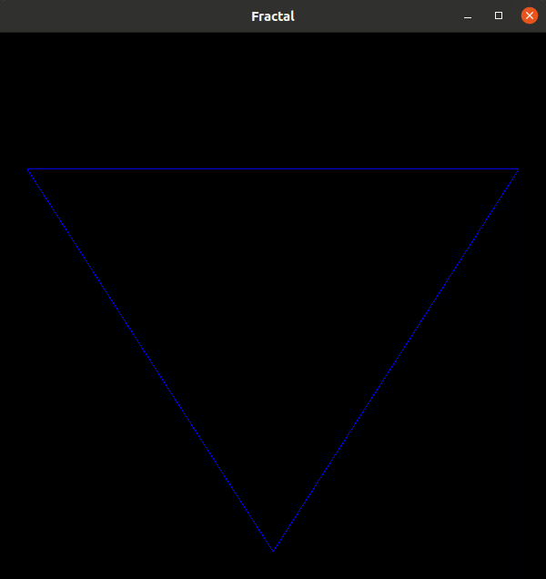

# Flocon de Koch OpenGL

[wikipedia flocon de Koch](https://fr.wikipedia.org/wiki/Flocon_de_Koch)

Practicing OpenGL shader and event keyboard with von Koch Fractal

# Demo

Use the arrow left/right to increase the step number

